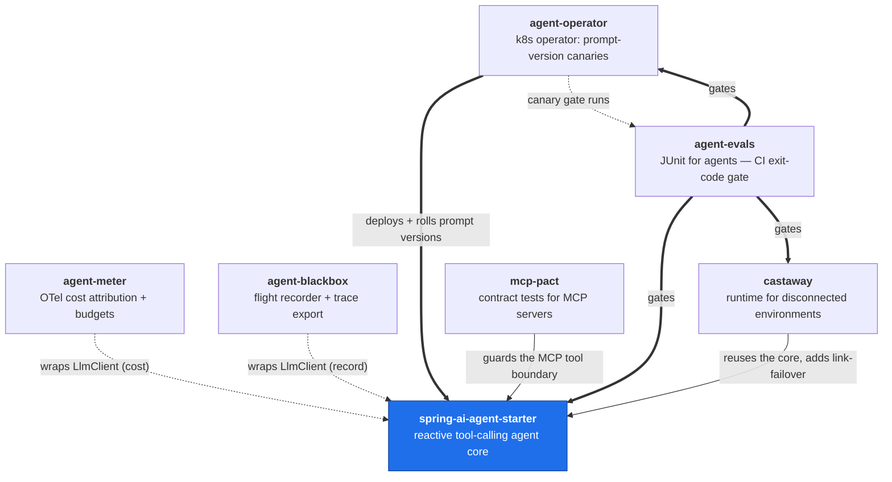

# Heyward Hagenbuch

AI/agent engineering on an enterprise JVM stack. I build the unglamorous parts
that make LLM systems shippable: bounded tool-calling loops, MCP integrations,
eval gates in CI, and the reactive plumbing underneath.

Day job: platform & AI tooling for a 60+ microservice fleet (Java/Spring
WebFlux, Kubernetes, GraphQL federation) — including an internal code-intelligence
MCP server with 50+ tools that gives coding agents whole-workspace context.

## The platform

These repos aren't seven demos — they compose. A production-shaped agent core,
and the layers you actually need to run one: observe its cost, record what it did,
survive a dead link, deploy it safely, gate it on evals, and contract-test its tools.

**Legend:** dotted = non-invasive decorator seam (add a dependency, no code change);
solid = builds on / guards; thick = eval gate.

## Repos

**Core**
- [spring-ai-agent-starter](https://github.com/hhagenbuch/spring-ai-agent-starter) —
  what an agent looks like in a production JVM service: a bounded, reactive
  tool-calling loop with retries, MCP mounting, and a unit-tested core.

**Observability & cost** *(decorator seams on the core)*
- [agent-meter](https://github.com/hhagenbuch/agent-meter) — OpenTelemetry-native
  token/cost attribution (per feature/session/prompt-version) with budgets that
  degrade before they deny. Add the dependency, get cost telemetry.
- [agent-blackbox](https://github.com/hhagenbuch/agent-blackbox) — the flight
  recorder: what the agent actually did, exportable for diffing and eval.

**Resilience**
- [castaway](https://github.com/hhagenbuch/castaway) — an agent runtime for
  disconnected/degraded environments: local-model failover, queued side-effects
  with revalidation, honesty under degradation.

**Delivery**
- [agent-operator](https://github.com/hhagenbuch/agent-operator) — a Kubernetes
  operator that treats a prompt like code: canary a new prompt version, gate the
  promotion on an eval Job, roll back on failure.

**Quality gates & contracts**
- [agent-evals](https://github.com/hhagenbuch/agent-evals) — JUnit for LLM agents:
  golden datasets, LLM-as-judge, exit-code CI gates (used across the platform).
- [mcp-pact](https://github.com/hhagenbuch/mcp-pact) — Pact-style contract testing
  for MCP servers, so a tool schema change can't silently break its consumers.

📫 heyward360@gmail.com
